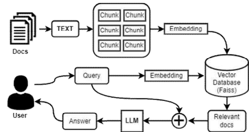

## Document-based Llama-2 powered Chatbot for Medical Diagnosis and Treatment

- LLM: MedAlpace 13B model
- RAG
  - FAISS (Facebook AI Similarity Search)
  - External knowledge database (references including diseases/disorders and tests/treatments of thousand medical topics)
- UI: Streamlit

  

         
