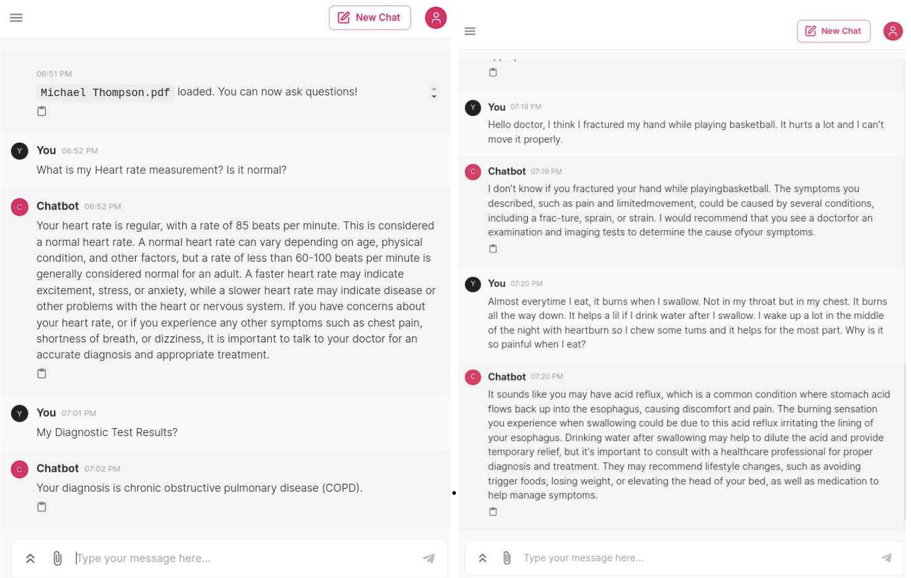

## Document-based Llama-2 powered Chatbot for Medical Diagnosis and Treatment

- LLM: MedAlpace 13B model
- RAG
  - FAISS (Facebook AI Similarity Search
  - External knowledge database (reference product including diseases/disorders and tests/treatments of thousand medical topic)
- UI: Streamlit

  
  

  # If image is in an `images` folder
         
